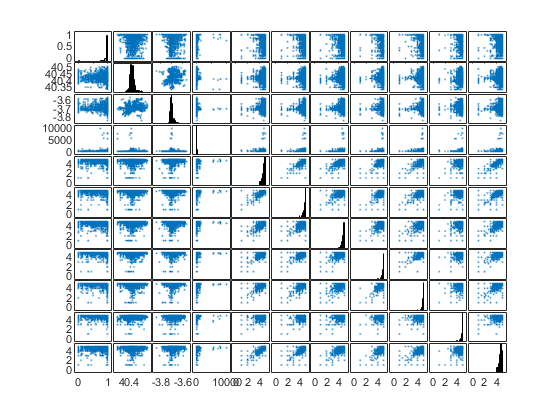
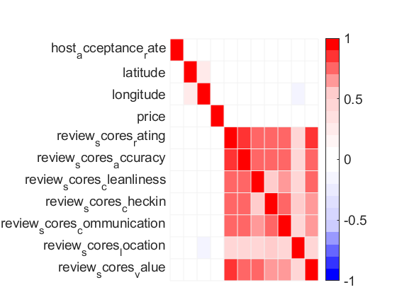
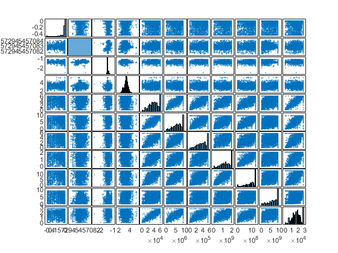
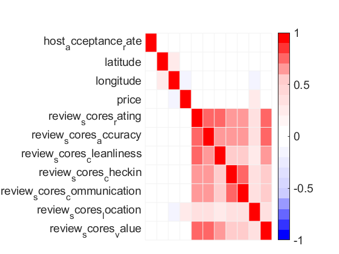
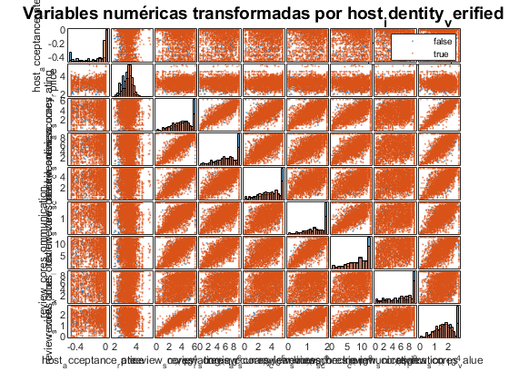
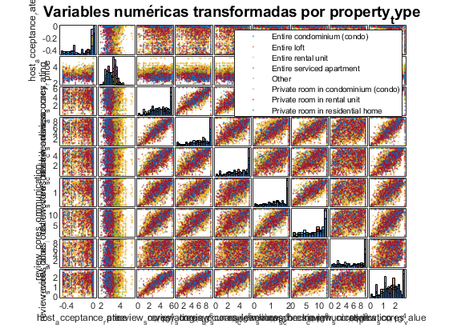
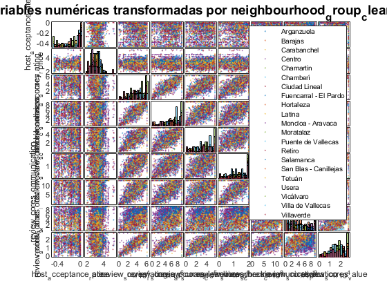

# Conjunto de Datos

Para esta tarea hemos escogido una base de datos relativa a apartamentos Airbnb de Madrid procedentes de la plataforma [**Inside Airbnb**](http://insideairbnb.com/get-the-data.html). Se trata de un portal en el que mensualmente se publican datos actualizados sobre dichos apartamentos. Nuestros datos proceden de una muestra publicada el **8 de diciembre de 2021**, por lo que son bastante recientes. 

Nuestro conjunto de datos partía de una muestra de tamaño $n = 17831$ apartamentos, habitaciones y anuncios del portal Airbnb, y de más de $p = 80$ variables categóricas (multi-estado y binarias) y numéricas (continuas y discretas). Hemos descartado aquellas variables con más porcentaje de datos faltantes (*NA*) y finalmente nos hemos quedado con una tamaño muestral de $n = 5362$ y un total de $p = 81$ variables.

Las variables de nuestra base de datos son: (ver siguiente página)

\clearpage
\begin{landscape}
\begin{longtable}[c]{lll}
\hline
\textbf{Variable}           & \textbf{Tipo}          & \textbf{Descripción}                                         \\ \hline
\endhead
%
\hline
\endfoot
%
\endlastfoot
%
host\_acceptance\_rate      & Numérica continua      & Porcentaje de ofertas que acepta el propietario.             \\
host\_total\_listings\_count   & Numérica discreta      & Número total de propiedades distintas ofertadas por el propietario en Airbnb.        \\
latitude                    & Numérica continua      & Latitud del apartamento.                                     \\
accomodates                 & Numérica discreta      & Capacidad (personas) del apartamento.                        \\
bathrooms                   & Numérica discreta      & Número de baños.                                             \\
bedrooms                    & Numérica discreta      & Número de habitaciones.                                      \\
beds                        & Numérica discreta      & Número de camas.                                             \\
price                       & Numérica continua      & Precio por noche (en \$).                                    \\
minimum\_nights             & Numérica discreta      & Número mínimo de noches.                                     \\
maximum\_nights             & Numérica discreta      & Número máximo de noches.                                     \\
availability\_30            & Numérica discreta      & Número de días disponibles en los 30 días siguientes.        \\
availability\_90            & Numérica discreta      & Número de días disponibles en los 90 días siguientes.        \\
number\_of\_reviews         & Numérica discreta      & Número de reseñas.                                           \\
number\_of\_reviews\_ltm    & Numérica discreta      & Número de reseñas en el último mes.                          \\
review\_scores\_rating      & Numérica continua      & Puntuación media general del apartamento.                    \\
review\_scores\_accuracy       & Numérica continua      & Puntuación media de la exactitud y detalle del anuncio.                              \\
review\_scores\_cleanliness & Numérica continua      & Puntuación media de la limpieza del apartamento.             \\
review\_scores\_checkin     & Numérica continua      & Puntuación media del checkin del apartamento.                \\
review\_scores\_communication  & Numérica continua      & Puntuación media de la comunicación con el propietario.                              \\
review\_scores\_location    & Numérica continua      & Puntuación media de la ubicación del apartamento.            \\
review\_scores\_value       & Numérica continua      & Puntuación media de la calidad/precio del apartamento.       \\
reviews\_per\_month         & Numérica discreta      & Número de reseñas por mes.                                   \\
host\_has\_profile\_pic        & Categórica binaria     & Indica si el propietario tiene foto de perfil (true) o no (false)                    \\
host\_identity\_verified    & Categórica binaria     & Indica si el propietario está verificado o no.               \\
neighbourhood\_cleansed     & Categórica multiestado & Indica el distrito en el que se encuentra el apto.           \\
neighbourhood\_group\_cleansed & Categórica multiestado & Indica el barrio en el que se encuentra el apto.                                     \\
property\_type                 & Categórica multiestado & Indica si se trata de un apartamento, habitación compartida, una villa, etc.         \\
room\_type                  & Categórica multiestado & Indica el tipo de habitación.                                \\
instant\_bookable           & Categórica binaria     & Indica si se puede reservar instantáneamente o no.           \\
facebook                    & Categórica binaria     & Indica si el apartamento aparece en facebook.                \\
reviews                     & Categórica binaria     & Indica si el apartamento tiene reseñas o no.                 \\
selfie                      & Categórica binaria     & Indica si el propietario tiene selfies suyos o no.           \\
government\_id              & Categórica binaria     & Indica si el apartamento está registrado oficialmente.       \\
Washer                      & Categórica binaria     & Indica si el apartamento tiene lavadora.                     \\
Stove                       & Categórica binaria     & Indica si el apartamento tiene cocina.                       \\
FireExtinguisher            & Categórica binaria     & Indica si el apartamento tiene extintor de fuegos.           \\
Dryer                       & Categórica binaria     & Indica si el apartamento tiene secadora.                     \\
Shampoo                     & Categórica binaria     & Indica si el apartamento tiene champú.                       \\
PaidParkingOffPremises         & Categórica binaria     & Indica si el apartamento tiene opción de parking privado fuera de las instalaciones. \\
DishesandSilverware         & Categórica binaria     & Indica si el apartamento tiene platos y cubiertos.           \\
FirstAidKit                 & Categórica binaria     & Indica si el apartamento tiene kit de primeros auxilios.     \\
HotWater                    & Categórica binaria     & Indica si el apartamento tiene agua caliente.                \\
ShowerGel                   & Categórica binaria     & Indica si el apartamento tiene gel de ducha.                 \\
FreeStreetParking           & Categórica binaria     & Indica si el apartamento tiene parking gratuito en la calle. \\
AirConditioning             & Categórica binaria     & Indica si el apartamento tiene aire acondicionado.           \\
Heating                     & Categórica binaria     & Indica si el apartamento tiene calefacción.                  \\
Toaster                     & Categórica binaria     & Indica si el apartamento tiene tostadora.                    \\
HostGreetsYou               & Categórica binaria     & Indica si el propietario te enseña el apartamento.           \\
LuggageDropoffAllocation       & Categórica binaria     & Indica si se incluye servicio para guardar el equipaje.                              \\
SmokeAlarm                  & Categórica binaria     & Indica si hay alarma de humo.                                \\
PocketWifi                  & Categórica binaria     & Indica si hay wifi portable.                                 \\
DedicatedWorkspace          & Categórica binaria     & Indica si hay zona de trabajo.                               \\
DryingRackForClothes        & Categórica binaria     & Indica si hay tendedor.                                      \\
Freezer                     & Categórica binaria     & Indica si hay congelador.                                    \\
Room\_darkeningShades       & Categórica binaria     & Indica si hay persianas.                                     \\
Microwave                   & Categórica binaria     & Indica si tiene microondas.                                  \\
Iron                        & Categórica binaria     & Indica si hay plancha.                                       \\
WineGlasses                 & Categórica binaria     & Indica si hay copas de vino.                                 \\
CoffeeMaker                 & Categórica binaria     & Indica si hay cafetera.                                      \\
BedLinens                   & Categórica binaria     & Indica si hay sábanas, fundas de cojines, etc.               \\
Hangers                     & Categórica binaria     & Indica si hay perchas.                                       \\
Wifi                        & Categórica binaria     & Indica si hay Wifi.                                          \\
Essentials                  & Categórica binaria     & Indica si hay productos esenciales.                          \\
DiningTable                 & Categórica binaria     & Indica si hay mesa de comedor.                               \\
EthernetConnection          & Categórica binaria.    & Indica si hay conexión ethernet.                             \\
LockOnBedroomDoor           & Categórica binaria     & Indica si hay pestillo en la puerta del dormitorio.          \\
CleaningProducts            & Categórica binaria     & Indica si hay productos de limpieza.                         \\
CookingBasics               & Categórica binaria     & Indica si hay utensilios básicos de cocina.                  \\
CableTV                     & Categórica binaria     & Indica si hay televisión por cable.                          \\
Bathtub                     & Categórica binaria     & Indica si hay bañera.                                        \\
Refrigerator                & Categórica binaria     & Indica si hay nevera.                                        \\
Elevator                    & Categórica binaria     & Indica si hay ascensor.                                      \\
PaidParkingOnPremises       & Categórica binaria     & Indica si hay parking privado en el mismo edificio.          \\
Breakfast                   & Categórica binaria     & Indica si se sirve desayuno.                                 \\
Oven                        & Categórica binaria     & Indica si hay horno.                                         \\
CarbonMonoxideAlarm         & Categórica binaria     & Indica si hay alarma de monóxido de carbono.                 \\
LongTermStaysAllowed        & Categórica binaria     & Indica si se permiten estancias largas.                      \\
Hairdryer                   & Categórica binaria     & Indica si hay secador                                        \\
Kitchen                     & Categórica binaria     & Indica si hay cocina.                                        \\ \hline
\end{longtable}
\end{landscape}

# Limpieza de Datos

Para realizar la mayor parte de la limpieza hemos usado R. Hemos descartado aquellas variables que contenían mayor proporción de *NA's* y convertido algunas variables como *amenities*. Esta variable, que tomaremos como ejemplo, devolvía para cada apartamento, un string con las amenidades del apartamento en este formato:

```
"[\"Hot water\", \"Iron\", \"Washer\", \"Air conditioning\", \"Cable TV\", ..."
```

Hemos convertido cada valor de todos los strings en variables binarias (true o false), siendo true si la palabra aparecía en el string de dicho apartamento y false si no, ya que no había otra manera de extraer información. Posteriormente hemos eliminado aquellas variables binarias que tenían una proporción muy alta de un tipo de respuesta (por ejemplo 99.93% true, 0.07 false). 

A continuación el código para la limpieza de datos:
```r
library(tidyverse)
library(lubridate)
airbnb_data <- read.csv("./listings2.csv", encoding = "UTF-8") 
```

Eliminamos la columna calendar, porque no nos sirve de nada:
```r
airbnb_data$calendar_updated <- NULL

## Eliminamos aquellos apartamentos donde aparecen valores no numéricos
no_numericos <- c("", "Half-bath", "Private half-bath", "Shared half-bath")
`%notin%` <- Negate(`%in%`)

airbnb_data <- filter(airbnb_data, bathrooms_text %notin% no_numericos)

airbnb_data$bathrooms <- as.numeric(unlist(regmatches(airbnb_data$bathrooms_text,
                         gregexpr("[[:digit:]]+\\.*[[:digit:]]*", airbnb_data$bathrooms_text))))

## Eliminamos las columnas innecesarias
variables_descartadas_apriori <- c("name", "listing_url", "last_scraped", "description", "neighborhood_overview", 
                               "picture_url", "host_id", "host_url", "host_name", 
                               "host_location", "host_about", "host_is_superhost", 
                               "host_thumbnail_url", "host_picture_url", "neighbourhood", 
                               "bathrooms_text", "minimum_minimum_nights", "maximum_minimum_nights", 
                               "minimum_maximum_nights", "maximum_maximum_nights", "minimum_nights_avg_ntm", 
                               "maximum_nights_avg_ntm", "calendar_last_scraped", "license")
airbnb_data <- select(airbnb_data, -variables_descartadas_apriori)


# First we substitute the strange values with NA's
patterns <- c("N/A", "-", "*", "[no name]", ".", "")

for(j in 1:ncol(airbnb_data)){
    for(i in 1:nrow(airbnb_data)){
            for(k in 1:length(patterns)){
                    if(airbnb_data[i, j] == patterns[k] & !is.na(airbnb_data[i, j])){
                            airbnb_data[i, j] <- NA
                    }
            }
    }
}

## Eliminamos los NA's, ya que seguimos quedandonos con un tamaño muestral grande
airbnb_data <- airbnb_data[complete.cases(airbnb_data), ]

## Ahora formateamos los datos
## Convertimos las variables categoricas en factor
lista_factores <- vector(mode = "list", length = ncol(airbnb_data))
for(j in 1:ncol(airbnb_data)){
    lista_factores[[j]] <- levels(as.factor(airbnb_data[, j]))
}

## Podemos comprobar que no hay na's ni valores raras
## Modificamos las variables amenities y host verifications para que sus atributos sean binarios

library(mgsub)
library(stringr)

host_verifications <- as.data.frame(mgsub(airbnb_data$host_verifications, c("\\[", "\\]", "\\,", "\\'") , c("", "", "", "")))
amenities <- as.data.frame(mgsub(airbnb_data$amenities, c("\\{", "\\}", "\\,", "\\'", "\\[", "\\]", "\"", "\\/") , c("", "", "  ", "", "", "", "", "")))

output_list_verifications <- list()
output_list_verifications_count <- list()
output_list_amenities <- list()
output_list_amenities_count <- list()
for(i in 1:nrow(host_verifications)){
    output_list_verifications[i] <- str_split(host_verifications[i, ], " ")[1]
    output_list_verifications_count[i] <- length(output_list_verifications[[i]])
    output_list_amenities[i] <- str_split(amenities[i, ], "  ")[1]
    output_list_amenities_count[i] <- length(output_list_amenities[[i]])
}

dummy_host_verifications_cols <- output_list_verifications[[which.max(output_list_verifications_count)]] # here we have the row with the most number of amenities, which we will use to create some dummy variables
dummy_host_verifications_df <- matrix(nrow = nrow(airbnb_data), ncol = length(dummy_host_verifications_cols)) %>% as.data.frame()
colnames(dummy_host_verifications_df) <- dummy_host_verifications_cols

dummy_amenities_cols <- output_list_amenities[[which.max(output_list_amenities_count)]] # here we have the row with the most number of amenities, which we will use to create some dummy variables
dummy_amenities_df <- matrix(nrow = nrow(airbnb_data), ncol = length(dummy_amenities_cols)) %>% as.data.frame()
colnames(dummy_amenities_df) <- dummy_amenities_cols

# Now we merge the new columns with the airbnb dataset and we fill them with Yes (1) or No (0)
airbnb_data <- cbind(airbnb_data, dummy_host_verifications_df, dummy_amenities_df)

# Ahora sustituimos por 1 si el apartamento tiene dicha amenidad o verificacion y por 0 si no la tiene
# Now we susbtitute the NA's with Yes(if the apartment has that verification or amenitie, and no if it doesn't)
for(l in 1:length(output_list_verifications)){
    for(j in 50:60){
            if(colnames(airbnb_data)[j] %in% output_list_verifications[[l]]){
                    airbnb_data[l, j] <- "true"
            } else{
                    airbnb_data[l, j] <- "false"
            }
    }
}

for(l in 1:length(output_list_amenities)){
    for(k in 61:ncol(airbnb_data)){
            if(colnames(airbnb_data)[k] %in% output_list_amenities[[l]]){
                    airbnb_data[l, k] <- "true"
            } else{
                    airbnb_data[l, k] <- "false"
            }
    }
}

airbnb_data$amenities <- NULL
airbnb_data$host_verifications <- NULL
airbnb_data$has_availability <- NULL
airbnb_data$is_business_travel_ready <- NULL
# Now I create variables that count the days since the host started, the days from the first review, and the days from the last review
airbnb_data$days_since_host <- (today() - as.Date(airbnb_data$host_since)) %>% as.numeric()
airbnb_data$days_since_first_review <- (today() - as.Date(airbnb_data$first_review)) %>% as.numeric()
airbnb_data$days_since_last_review <- (today() - as.Date(airbnb_data$last_review)) %>% as.numeric()
airbnb_data$host_since <- NULL
airbnb_data$first_review <- NULL
airbnb_data$last_review <- NULL
airbnb_data$host_response_time <- NULL
airbnb_data$host_listings_count <- NULL
airbnb_data$host_neighbourhood <- NULL
airbnb_data$scrape_id <- NULL

# Numeric columns with percentages 
for(i in c(2, 3)){
    airbnb_data[, i] <- as.numeric(gsub("%", "", airbnb_data[, i])) / 100
}

# Numeric columns with dollar sign
airbnb_data[, "price"] <- gsub("\\$", "", airbnb_data[, "price"]) # the dollar is a regular expression
airbnb_data[, "price"] <- gsub(",", "", airbnb_data[, "price"]) %>% as.numeric()

# Boolean columns
for(i in c("host_has_profile_pic", "host_identity_verified", "instant_bookable")){
    airbnb_data[, i] <- gsub("t", "true", airbnb_data[, i])
    airbnb_data[, i] <- gsub("f", "false", airbnb_data[, i])
}

# Agrupamos categorias en la variable tipo de propiedad (property_type)
airbnb_data$property_type <- as.factor(airbnb_data$property_type)
categorias_iniciales_property_type <- levels(airbnb_data$property_type)
property_type_ordered <- airbnb_data %>% count(property_type, sort = TRUE)
top7_categorias <- as.character(property_type_ordered[c(1:7), 1])
vector_booleano <- vector(length = length(top7_categorias))
categorias_finales_property_type <- vector(length = length(categorias_iniciales_property_type))

for(i in 1:length(categorias_iniciales_property_type)){
    for (j in 1:length(top7_categorias)){
            if(categorias_iniciales_property_type[i] == top7_categorias[j]){
                    vector_booleano[j] <- TRUE
            } else {
                    vector_booleano[j] <- FALSE
            }
            
            if(any(vector_booleano == TRUE)){
                    categorias_finales_property_type[i] <- top7_categorias[vector_booleano == TRUE]
            } else {
                    categorias_finales_property_type[i] <- "Other"
            }
    }
    vector_booleano <- vector(length = length(top7_categorias))
}

# Ahora sustituimos los levels y ya tendremos las variables agrupadas
levels(airbnb_data$property_type) <- categorias_finales_property_type
airbnb_data$property_type <- factor(airbnb_data$property_type, levels = c(top7_categorias, "Other")) 

# Eliminamos algunas variables más
eliminar_variables <- c("X.U.FEFF.id", "calculated_host_listings_count_entire_homes", 
                    "calculated_host_listings_count_entire_homes", "calculated_host_listings_count_private_rooms", 
                    "calculated_host_listings_count_shared_rooms", "jumio", 
                    "offline_government_id", "sent_id", 
                    "identity_manual", "Extra pillows and blankets", 
                    " Barbecue utensils", " Single level home", 
                    "email", "phone", 
                    " Portable fans", " Private patio or balcony",
                    " Backyard", " Window guards", 
                    " Outlet covers", " TV with standard cable",
                    " Table corner guards", " Hot water kettle", 
                    " Baking sheet", " Baking sheet", 
                    " Laundromat nearby", " Beach essentials", 
                    " dove", "body soap", 
                    " Children\\u2019s books and toys", " Outdoor furniture", 
                    " Cleaning before checkout", " Rice maker", 
                    " Safe", " Bluetooth sound system", " dove conditioner",
                    " Clothing storage: walk-in closet", " Shared gym nearby",
                    " Outdoor dining area", " Board games", 
                    "days_since_last_review", "days_since_host", "days_since_first_review",
                    "host_response_rate", "availability_60", 
                    "availability_365", "number_of_reviews_l30d", "calculated_host_listings_count")

airbnb_data <- select(airbnb_data, -eliminar_variables)
head(airbnb_data)
```

```
##   host_acceptance_rate host_total_listings_count host_has_profile_pic
## 1                 0.72                         1                 true
## 2                 0.00                         2                 true
## 5                 0.65                         1                 true
## 7                 0.98                        12                 true
## 8                 0.57                         1                 true
## 9                 1.00                         2                 true
##   host_identity_verified neighbourhood_cleansed neighbourhood_group_cleansed
## 1                   true         Hispanoamérica                    Chamartín
## 2                   true               Cármenes                       Latina
## 5                   true                Legazpi                   Arganzuela
## 7                   true               Justicia                       Centro
## 8                   true                   Goya                    Salamanca
## 9                   true               Justicia                       Centro
##   latitude longitude                    property_type       room_type
## 1 40.45724  -3.67688      Private room in rental unit    Private room
## 2 40.40381  -3.74130      Private room in rental unit    Private room
## 5 40.38975  -3.69018 Private room in residential home    Private room
## 7 40.41969  -3.69736               Entire rental unit Entire home/apt
## 8 40.42792  -3.67682       Entire condominium (condo) Entire home/apt
## 9 40.41884  -3.69655      Private room in rental unit    Private room
##   accommodates bathrooms bedrooms beds price minimum_nights maximum_nights
## 1            2       1.0        1    1    59              1           1125
## 2            1       1.0        1    1    31              4             40
## 5            1       1.0        1    1    29              2           1125
## 7            4       1.0        1    2    83              2            500
## 8            3       2.0        2    2    82             10            999
## 9            3       1.5        1    2    52              1             90
##   availability_30 availability_90 number_of_reviews number_of_reviews_ltm
## 1              10              59                81                     3
## 2               0               1                33                     0
## 5              11              69               154                     5
## 7               9              69               120                     2
## 8               0               7                55                     0
## 9              15              75               113                    34
##   review_scores_rating review_scores_accuracy review_scores_cleanliness
## 1                 4.88                   4.91                      4.82
## 2                 4.58                   4.72                      4.56
## 5                 4.68                   4.81                      4.92
## 7                 4.61                   4.72                      4.68
## 8                 4.83                   4.88                      4.86
## 9                 4.60                   4.83                      4.40
##   review_scores_checkin review_scores_communication review_scores_location
## 1                  4.80                        4.89                   4.78
## 2                  4.75                        4.82                   4.21
## 5                  4.79                        4.71                   4.71
## 7                  4.55                        4.86                   4.95
## 8                  4.86                        4.82                   4.90
## 9                  4.80                        4.88                   4.96
##   review_scores_value instant_bookable calculated_host_listings_count
## 1                4.85            false                              1
## 2                4.67            false                              2
## 5                4.72            false                              1
## 7                4.68             true                              9
## 8                4.78            false                              2
## 9                4.50             true                              2
##   reviews_per_month facebook reviews selfie government_id  Washer  Stove
## 1              0.57    false    true  false          true    true  false
## 2              0.38    false    true  false          true    true  false
## 5              1.09    false    true  false          true   false  false
## 7              0.87    false    true  false          true    true  false
## 8              0.41    false    true  false          true    true  false
## 9              2.59     true    true   true          true    true  false
##    Fire extinguisher  Dryer  Shampoo  Paid parking off premises
## 1              false  false     true                      false
## 2               true  false     true                      false
## 5              false  false     true                      false
## 7              false  false     true                       true
## 8              false  false     true                      false
## 9              false   true     true                      false
##    Dishes and silverware  First aid kit  Hot water  Shower gel
## 1                   true          false       true       false
## 2                   true           true       true       false
## 5                   true          false      false       false
## 7                   true          false       true        true
## 8                  false          false      false       false
## 9                   true           true       true       false
##    Free street parking  Air conditioning  Heating  Toaster  Host greets you
## 1                false              true     true    false            false
## 2                false              true     true    false            false
## 5                false             false     true    false             true
## 7                false              true     true    false            false
## 8                false              true     true    false             true
## 9                false             false     true    false            false
##    Luggage dropoff allowed  Smoke alarm  Pocket wifi  Dedicated workspace
## 1                    false        false         true                false
## 2                    false        false         true                 true
## 5                    false        false        false                false
## 7                     true        false        false                 true
## 8                    false        false        false                 true
## 9                    false        false         true                 true
##    Drying rack for clothing  Freezer  Room-darkening shades  Microwave  Iron
## 1                     false    false                  false      false  true
## 2                     false    false                  false       true  true
## 5                     false    false                  false      false false
## 7                     false    false                  false       true  true
## 8                     false    false                  false      false  true
## 9                     false    false                  false      false  true
##    Wine glasses  Coffee maker  Bed linens  Hangers  Wifi  Essentials
## 1         false         false        true     true  true        true
## 2         false          true        true     true  true        true
## 5         false         false        true     true  true        true
## 7         false          true        true     true  true        true
## 8         false          true       false     true  true        true
## 9         false         false       false     true  true        true
##    Dining table  Ethernet connection  Lock on bedroom door  Cleaning products
## 1         false                false                 false              false
## 2         false                false                  true              false
## 5         false                false                 false              false
## 7         false                false                 false              false
## 8         false                false                 false              false
## 9         false                false                 false              false
##    Cooking basics  Cable TV  Bathtub  Refrigerator  Elevator
## 1            true     false    false         false      true
## 2            true     false    false          true      true
## 5           false     false    false          true      true
## 7            true     false    false          true      true
## 8           false     false    false         false      true
## 9           false     false    false          true     false
##    Paid parking on premises  Breakfast  Oven  Carbon monoxide alarm
## 1                     false      false false                  false
## 2                     false      false  true                  false
## 5                     false      false false                  false
## 7                     false      false false                  false
## 8                      true      false false                  false
## 9                     false      false false                  false
##    Long term stays allowed  Hair dryer  Kitchen
## 1                     true        true     true
## 2                     true        true     true
## 5                     true        true    false
## 7                     true        true     true
## 8                     true        true     true
## 9                     true        true     true
```


```r
# Guardamos los datos en un csv
write_csv(airbnb_data, file = "datos_limpios.csv")
```

\newpage
# Lectura de Datos
Hemos usado R para la limpieza de datos, pero de aquí en adelante todo el código se ha realizado mediante MATLAB.
Primero leemos los datos que hemos limpiado previamente, MATLAB, nos convierte los nombres de columnas a nombres válidos directamente.

Separamos variables numéricas y categóricas:


```matlab
airbnb_data = readtable('datos_limpios.csv');
```

Separamos variables numéricas y categóricas


```matlab
variables_numericas = airbnb_data(:, vartype('numeric'));
```

Convertimos las variables tipo *cell* en *categorical*, ya que nos facilitará el trabajo posteriormente.


```matlab
variables_cell = airbnb_data(:, vartype("cell"));
variables_categoricas = array2table(zeros(size(variables_cell)));
variables_categoricas.Properties.VariableNames = variables_cell.Properties.VariableNames;
variables_categoricas = convertvars(variables_cell, variables_categoricas.Properties.VariableNames,'categorical');
```

Convertimos la tabla que contiene las variables numéricas en una matriz, y extraemos los nombres de las correspondientes variables:


```matlab
X = table2array(variables_numericas);
nombres_variables_numericas = categorical(variables_numericas.Properties.VariableNames);
```

\newpage
# Variables numéricas

Primeramente dividimos entre variables continuas y discretas:


```matlab
continuas = [1, 3, 4, 9, 16:22];
discretas = setdiff(1:size(X, 2), continuas);
X_continuas = X(:, continuas);
nombres_variables_continuas = nombres_variables_numericas(continuas);
X_discretas = X(:, discretas);
nombres_variables_discretas = nombres_variables_numericas(discretas);
```

Ahora nos centraremos únicamente en variables continuas, ya que los métodos que usaremos requieren suponer una hipótesis de **normalidad**. Realizamos un *gplotmatrix()* para ver qué aspecto tienen las variables continuas:


```matlab
%plot inline
figure
plotmatrix(X_continuas)
```



Según lo que podemos ver, los datos no parece que sigan una normal multivariante, ya que vemos que hay fuertes asimetrías. Obtenemos el vector de medias muestrales, la matriz de covarianzas muestral y de correlaciones:

Usamos la función [*plot_map*](https://es.mathworks.com/matlabcentral/fileexchange/47531-josecamachop-meda-toolbox) que nos permite ver la matriz de correlaciones de manera más visual:

\clearpage
```matlab
%%file plot_map.m
function fig_h = plot_map(map,label,int,ind)
% Plot color map.
%
% plot_map(map) % minimum call
% plot_map(map,label) % complete call
%
%
% INPUTS:
%
% map: (MxM) matrix with values in the [0,1] interval. 
%
% label: (Mx1) name of the variables (numbers are used by default)
%
% int: (2x1) color interval ([-1;1] by default)
%
% ind: (Lx1) color distribution ([0:.2:0.79 0.8:0.04:1]' by default);
%
% OUTPUTS:
%
% fig_h: (1x1) figure handle.
%
%
% EXAMPLE OF USE: Random data
%
% X = simuleMV(20,10,8);
% plot_map(corr(X));
%
%
% coded by: Jose Camacho Paez (josecamacho@ugr.es)
%           Alejandro Perez Villegas (alextoni@gmail.com)
% last modification: 08/Apr/20
%
% Copyright (C) 2020  University of Granada, Granada
% Copyright (C) 2020  Jose Camacho Paez, Alejandro Perez Villegas
% 
% This program is free software: you can redistribute it and/or modify
% it under the terms of the GNU General Public License as published by
% the Free Software Foundation, either version 3 of the License, or
% (at your option) any later version.
% 
% This program is distributed in the hope that it will be useful,
% but WITHOUT ANY WARRANTY; without even the implied warranty of
% MERCHANTABILITY or FITNESS FOR A PARTICULAR PURPOSE.  See the
% GNU General Public License for more details.
% 
% You should have received a copy of the GNU General Public License
% along with this program.  If not, see <http://www.gnu.org/licenses/>.
%% Parameters checking
% Set default values
routine=dbstack;
assert (nargin >= 1, 'Error in the number of arguments. Type ''help %s'' for more info.', routine(1).name);
M = size(map,2);
if nargin < 2 || isempty(label), label= 1:M; end
if nargin < 3 || isempty(int), int = [-1;1]; end;
if nargin < 4 || isempty(ind), ind = [0:.2:0.79 0.8:0.04:1]'; end;
% Convert row arrays to column arrays
if size(label,1)  == 1, label = label'; end;
% Convert int arrays to str
if ~isempty(label) && isnumeric(label),
    vecn = label; 
    veci = 1:length(vecn);
    if length(label)>2, 
        max_lab = 30; % limit the number of labels displayed
        ini = 2;
        stepN = [];
        while isempty(stepN),
            lenv = length(vecn(ini:end));
            div = 1:(lenv-1);
            div = div(rem(lenv,div)==0);
            stepN = div(find(div>lenv/max_lab,1));
            ini = ini+1;
        end
        veci = 1:(lenv+ini-2);
        veci = veci(round([1 (ini-2+stepN):stepN:end]));
    end
    for i=veci,
        labele{i} = num2str(vecn(i));
    end
    label=labele'; 
end
% Convert char arrays to cell
if ischar(label),  label = cellstr(label); end;
%% Main code
fig_h=figure;
map3 = [map map(:,end);map(end,:) map(end,end)];
sur_h=surface((1:M+1)'*ones(1,M+1),ones(M+1,1)*(1:M+1),map3);
if M < 100
    set(sur_h,'EdgeColor',[0.95 0.95 0.95]);
else
    set(sur_h,'EdgeColor','none');
end
% Label font size
axes_h = get(sur_h,'Parent');
if ~isempty(label)
    label_length = max(cellfun('length', label));
    label_size = 300/(length(find(~cellfun('isempty', label)))*label_length);
    set(axes_h, 'FontSize', max(min(18,round(label_size)), 14));
end
% Set axis properties
set(axes_h,'Box','on');
set(axes_h,'XAxisLocation','top');
set(axes_h,'YDir','reverse');
if ~isempty(label)
    stepY = ceil(0.05*M/label_size);
    stepX = ceil(0.2*M/label_size);
    if stepX==1,
        set(axes_h,'XTick',(1:M)+0.5);
        set(axes_h,'XTickLabel',label);
    else
        set(axes_h,'XTickLabel','');
    end
    if stepY==1,
        set(axes_h,'YTick',(1:M)+0.5);
        set(axes_h,'YTickLabel',label);
    else
        set(axes_h,'YTickMode','auto');
    end
end
% Resize axes position
pos = get(axes_h, 'Position');
set(axes_h,'Position',[pos(1) pos(2)/2 pos(3) pos(4)])
% Set colors
if int(1)<0,
    set(fig_h,'Colormap',[[ind;ones(length(ind),1)] [ind;flipud(ind)] [ones(length(ind),1);flipud(ind)]])
else
    set(fig_h,'Colormap',[[ones(length(ind),1)] [flipud(ind)] [flipud(ind)]])
end
caxis(int);
if find(map>0 & map<=1)
    c_h=colorbar;
    set(c_h,'FontSize',14);
end
axis([1,M+1,1,M+1]);
```

    Created file 'C:\Users\marct\Documents\UNI_ESTADISTICA\3o\SEGUNDO CUATRIMESTRE\ANÁLISIS MULTIVARIANTE\TRABAJOS\DATOS\Airbnb Madrid\plot_map.m'.
    


```matlab
m = mean(X_continuas)
S = cov(X_continuas, 1)
R = corr(X_continuas)
plot_map(R, char(nombres_variables_continuas.'))
```

    
    m =
    
        0.8741   40.4203   -3.6954  119.3581    4.6562    4.7429    4.6990    4.8045    4.8003    4.8063    4.6133
    
    
    S =
    
       1.0e+05 *
    
        0.0000   -0.0000   -0.0000   -0.0000    0.0000    0.0000    0.0000   -0.0000    0.0000    0.0000    0.0000
       -0.0000    0.0000    0.0000   -0.0000    0.0000    0.0000    0.0000    0.0000    0.0000    0.0000    0.0000
       -0.0000    0.0000    0.0000   -0.0000    0.0000    0.0000    0.0000    0.0000    0.0000   -0.0000    0.0000
       -0.0000   -0.0000   -0.0000    1.0428   -0.0000   -0.0000   -0.0000   -0.0000   -0.0000    0.0000   -0.0000
        0.0000    0.0000    0.0000   -0.0000    0.0000    0.0000    0.0000    0.0000    0.0000    0.0000    0.0000
        0.0000    0.0000    0.0000   -0.0000    0.0000    0.0000    0.0000    0.0000    0.0000    0.0000    0.0000
        0.0000    0.0000    0.0000   -0.0000    0.0000    0.0000    0.0000    0.0000    0.0000    0.0000    0.0000
       -0.0000    0.0000    0.0000   -0.0000    0.0000    0.0000    0.0000    0.0000    0.0000    0.0000    0.0000
        0.0000    0.0000    0.0000   -0.0000    0.0000    0.0000    0.0000    0.0000    0.0000    0.0000    0.0000
        0.0000    0.0000   -0.0000    0.0000    0.0000    0.0000    0.0000    0.0000    0.0000    0.0000    0.0000
        0.0000    0.0000    0.0000   -0.0000    0.0000    0.0000    0.0000    0.0000    0.0000    0.0000    0.0000
    
    
    R =
    
        1.0000   -0.0320   -0.0629   -0.0106    0.0113    0.0344    0.0553   -0.0016    0.0050    0.0682    0.0373
       -0.0320    1.0000    0.2889   -0.0500    0.0513    0.0407    0.0379    0.0394    0.0365    0.0788    0.0165
       -0.0629    0.2889    1.0000   -0.0324    0.0591    0.0495    0.0384    0.0397    0.0451   -0.1120    0.0358
       -0.0106   -0.0500   -0.0324    1.0000   -0.0146   -0.0051   -0.0032   -0.0109   -0.0207    0.0101   -0.0132
        0.0113    0.0513    0.0591   -0.0146    1.0000    0.8323    0.7846    0.7017    0.7655    0.4916    0.8478
        0.0344    0.0407    0.0495   -0.0051    0.8323    1.0000    0.7202    0.7071    0.7355    0.4895    0.7670
        0.0553    0.0379    0.0384   -0.0032    0.7846    0.7202    1.0000    0.5984    0.6252    0.4500    0.7498
       -0.0016    0.0394    0.0397   -0.0109    0.7017    0.7071    0.5984    1.0000    0.7711    0.5022    0.6548
        0.0050    0.0365    0.0451   -0.0207    0.7655    0.7355    0.6252    0.7711    1.0000    0.4816    0.6831
        0.0682    0.0788   -0.1120    0.0101    0.4916    0.4895    0.4500    0.5022    0.4816    1.0000    0.4883
        0.0373    0.0165    0.0358   -0.0132    0.8478    0.7670    0.7498    0.6548    0.6831    0.4883    1.0000
    
    
    ans = 
    
      Figure (1) with properties:
    
          Number: 1
            Name: ''
           Color: [0.9400 0.9400 0.9400]
        Position: [488 342 560 420]
           Units: 'pixels'
    
      Use GET to show all properties
    


    
    
Podemos ver claramente que las variables relacionadas con la puntuación del apartamento (*ratings*), tienen una gran asimetría a la izquierda, es decir que en general el consumidor suele poner buenas reseñas. Además, podemos ver que las variables más correlacionadas son aquellas relacionadas con el rating del apartamento.

\clearpage
# Mapas

## Mapa de precios por barrios

Hemos realizado algunos mapas, mediante la herramienta *QGIS*, para analizar visualmente los datos, puesto que se trata de datos geográficos:


Podemos ver que los barrios más caros se situan en la zona centro y norte de la capital principalmente, así que podríamos esperar que hubiera relación entre el precio y la ubicación (longitud, latitud) de los pisos.

## Mapa del tipo de propiedades ofertadas


Podemos ver que la mayoría de anuncios de Airbnb de Madrid, tienen que ver con apartamentos enteros (azul) y habitaciones privadas.

## Transformaciones de Box-Cox

### Teoría

Dada una variable aleatoria $y$ el objetivo de la transformación de Box-Cox es conseguir la hipótesis habitual de normalidad, esto es $\mathbf{y} \sim N(\boldsymbol{X \beta}, \sigma^2 \boldsymbol{I}_n)$. Para ello se propone la siguiente transformación:
$$ y(\lambda) = \left\{
\begin{array}{ll}
      \frac{y^\lambda - 1}{\lambda} \quad  \text{si $\lambda \ne 0$}\\
      \log y \quad \text{si $\lambda = 0$}\\
\end{array} 
\right.$$

Para ello es necesario que la variable de interés sea positiva, es decir: $y > 0$. Por ello consideraremos la fórmula extendida, en la que se incorpora $\lambda_2$ conocido, como aquél número tal que $y + \lambda_2 > 0$ y $\lambda_1$ sigue siendo el único parámetro del modelo.:

$$ y(\boldsymbol{\lambda}) = \left\{
\begin{array}{ll}
      \frac{(y + \lambda_2)^{\lambda_1} - 1}{\lambda_1} \quad  \text{si $\lambda_1 \ne 0$}\\
      \log (y + \lambda_2) \quad \text{si $\lambda_1 = 0$}\\
\end{array} 
\right.$$
donde $\boldsymbol{\lambda} = (\lambda_1, \lambda_2)'$

Esta transformación no asegura la normalidad, pero aun en casos  en que no exista transformación potencial que lleve a la normal, las estimaciones de $\lambda$ llevan a una distribución generalmente simétrica.

\clearpage
\textbf{Estimación de} $\boldsymbol{\lambda}$

El enfoque clásico consiste en usar Máxima Verosimilitud para estimar el parámetro de transformación $\lambda$. Este método se usa habitualmente ya que la función de verosimilitud es sencilla y además es fácil realizar inferencia sobre $\lambda$ debido a las propiedades asintóticas del estimador máximo verosímil.

Supongamos que las variables transformadas $\boldsymbol{y(\lambda)} \sim N(\boldsymbol{X \beta}, \sigma^2 \boldsymbol{I}_n)$, donde $\mathbf{X}$ es la matriz de diseño, $\mathbf{y} = (y_1, \dots, y_n)'$ la muestra de la variable $y$, $\mathbf{y(\lambda)} = (y_1(\lambda), \dots, y_n(\lambda))'$ el vector transformado y los parámetros del modelo son $(\lambda, \boldsymbol{\beta}, \sigma^2)$ .

La función de densidad de $\mathbf{y(\lambda)}$ es:
$$
f(\mathbf{y(\lambda)}) = \frac{\exp(-\frac{1}{2\sigma^2} (\mathbf{y(\lambda) - \boldsymbol{X \beta}})'(\mathbf{y(\lambda)} - \boldsymbol{X \beta}))}{(2 \pi \sigma^2)^{\frac{n}{2}}}
$$

Sea $J(\lambda, \mathbf{y}) = \prod_{i = 1}^{n} y_i^{\lambda - 1}$ el jacobiano de la transformación de $\mathbf{y}$ a $\mathbf{y(\lambda)}$, entonces la función de densidad de la muestra $\mathbf{y}$ (o función de verosimilitud) es:
$$
f(\mathbf{y}) = L(\lambda, \boldsymbol{\beta}, \sigma^2 | \mathbf{y}, \mathbf{X}) = 
 \frac{\exp(-\frac{1}{2\sigma^2} (\mathbf{y(\lambda) - \boldsymbol{X \beta}})'(\mathbf{y(\lambda)} - \boldsymbol{X \beta}))}{(2 \pi \sigma^2)^{\frac{n}{2}}} J(\lambda, \mathbf{y})
$$

Para obtener la estimación máximo verosímil, observemos que para cada $\lambda$ fijo, la ecuación de verosimilitud es proporcional a la que usamos para estimar $(\boldsymbol{\beta}, \sigma^2)$ para el vector observado $\mathbf{y(\lambda)}$. Entonces las estimaciones máximo verosímiles para $(\boldsymbol{\beta}, \sigma^2)$ son:
\begin{align*}
\hat{\boldsymbol{\beta}}(\lambda) & = (X'X)^{-1} X' y(\lambda) \\
\hat{\sigma^2}(\lambda) & = \frac{y(\lambda)'(\mathbf{I}_n - \mathbf{G}) \mathbf{y}(\lambda)}{n}
\end{align*}

donde $\mathbf{G} = X(X'X)^{-1}X'$.

Sustituyendo $\hat{\boldsymbol{\beta}}(\lambda)$ y $\hat{\sigma^2}(\lambda)$, en la función de verosimilitud $L(\lambda, \boldsymbol{\beta}, \sigma^2 | \mathbf{y}, \mathbf{X})$ y tomando el logaritmo (función log-verosimilitud):
\begin{align*}
l_P(\lambda) & = \log(L(\lambda, \boldsymbol{\beta}, \sigma^2 | \mathbf{y}, \mathbf{X})) \\
& = l(\lambda | \mathbf{y}, \mathbf{X}, \hat{\boldsymbol{\beta}}(\lambda), \hat{\sigma^2}(\lambda)) \\
& = C - \frac{n}{2} \log(\hat{\sigma^2}(\lambda)) + (\lambda - 1) \sum_{i = 1}^{n} \log (y_i)
\end{align*}
podemos ver que la función log-verosimilitud se puede maximizar en función de un solo parámetro $\lambda$.

Sea $g = (\prod_{i = 1}^{n} y_i)^{1/n}$ la media geométrica de la variable respuesta y sea $\mathbf{y}(\lambda, g) = \frac{\mathbf{y}(\lambda)}{g^{\lambda - 1}}$. Entonces, se puede demostrar que:
$$
l_P(\lambda) = C - \frac{n}{2} \log(s_{\lambda}^2)
$$

donde $s_{\lambda}^2$ es la suma residual de cuadrados dividida entre $n$ al ajustar el modelo $\mathbf{y}(\lambda, g) \sim N(\boldsymbol{X \beta}, \sigma^2 \mathbf{I_n})$. Entonces para encontrar el $\lambda$ que maximiza la función log-verosimilitud ($l_P(\lambda)$) tan solo debemos encontrar el $\lambda$ que minimiza:
$$
s_{\lambda}^2 = \frac{\mathbf{y}(\lambda, g)' (\mathbf{I}_n - \mathbf{G}) \mathbf{y}(\lambda, g)}{n}
$$

En la práctica, cuando usamos transformaciones de Box-Cox, primero se suele estimar $\lambda$ mediante métodos iterativos: fijando un rango de posibles de valores de $\lambda$, llevando a cabo la estimación para cada valor y escogiendo el mejor $\lambda$. Entonces el valor estimado de $\lambda$ se toma como *conocido* y se hace inferencia sobre $(\boldsymbol{\beta}, \sigma)$ condicionado a $\lambda = \hat{\lambda}$

### Aplicación

Creamos una función que aplica el algoritmo de Box-Cox a nuestra matriz de variables continuas (aplica el algoritmo anterior a cada una de las variables continuas), y nos devuelve una matriz transformada, así como los valores de $\lambda_1$ (*lambda*) y $\lambda_2$ (*negativos_a_positivos*) y los p-valores que resultan al realizar a cada variable transformada un test de Kolmogorov-Smirnov-Lilliefors, para contrastar la normalidad.

```matlab
%%file transformar_boxcox.m
function [X_transformada, negativos_a_positivos, lambda, p_valores] = transformar_boxcox(X, nombres_variables_numericas, plot)
X_transformada = zeros(size(X));
lambda = zeros(size(X_transformada, 2), 1);
minimo_variable = zeros(1, size(X_transformada, 2));
p_valores = zeros(1, size(X_transformada, 2));
negativos_a_positivos = zeros(1, size(X_transformada, 2));
for i = 1:size(X, 2)
    minimo_variable(i) = min(X(:, i));
    variable_desplazada = X(:, i); % en este caso no desplazamos
    negativos_a_positivos(i) = 0;
    if minimo_variable(i) <= 0
        % valor de lambda_2, que hace que la variable sea positiva
        negativos_a_positivos(i) = abs(minimo_variable(i)) + 0.001;
        variable_desplazada = X(:, i) + negativos_a_positivos(i);
    end
    [variable_transformada, lambda(i)] = boxcox(variable_desplazada);
    X_transformada(:, i) = variable_transformada;

    % Realizamos contraste de Kolmogorov-Smirnov-Lilliefors
    [h, p_valores(i)] = lillietest(variable_transformada);
    
    % Graficamos
    if plot == true
        figure
        hist(variable_transformada)
        xlabel(char(nombres_variables_numericas(i))) 
    end
end
end
```

    Created file 'C:\Users\marct\Documents\UNI_ESTADISTICA\3o\SEGUNDO CUATRIMESTRE\ANÁLISIS MULTIVARIANTE\TRABAJOS\DATOS\Airbnb Madrid\transformar_boxcox.m'.
    

```matlab
warning('off','all') % para evitar que nos de warning al ser los pvalores muy pequeños
[X_continuas_transformada, negativos_a_positivos, lambda, p_valores] = transformar_boxcox(X_continuas, nombres_variables_numericas, false); % para que no se impriman los histogramas
plotmatrix(X_continuas_transformada)
p_valores
warning('on','all') % volvemos a activar
```

    
    p_valores =
    
       1.0e-03 *
    
        1.0000    1.0000    1.0000    1.0000    1.0000    1.0000    1.0000    1.0000    1.0000    1.0000    1.0000
    


   
 
Podemos ver que rechazamos la hipótesis de normalidad en todas las variables transformadas, aunque se observa una mejora en cuanto a la simetría de las mismas. Aun así, supondremos **normalidad en los datos**.

Obtenemos los vectores de medias, matriz de covarianzas y correlaciones muestrales de las variables transformadas:

```matlab
m_transformada = mean(X_continuas_transformada)
S_transformada = cov(X_continuas_transformada, 1)
R_transformada = corr(X_continuas_transformada)
plot_map(R_transformada, char(nombres_variables_continuas.'))
```

    
    m_transformada =
    
       1.0e+09 *
    
       -0.0000    0.0000   -0.0000    0.0000    0.0000    0.0060    0.0004    1.3287    0.8748    6.1408    0.0000
    
    
    S_transformada =
    
       1.0e+18 *
    
        0.0000   -0.0000   -0.0000    0.0000   -0.0000   -0.0000    0.0000   -0.0000   -0.0000    0.0000   -0.0000
       -0.0000    0.0000    0.0000    0.0000    0.0000    0.0000    0.0000    0.0000    0.0000    0.0000    0.0000
       -0.0000    0.0000    0.0000   -0.0000    0.0000    0.0000    0.0000    0.0000    0.0000   -0.0000    0.0000
        0.0000    0.0000   -0.0000    0.0000    0.0000    0.0000    0.0000   -0.0000   -0.0000    0.0000   -0.0000
       -0.0000    0.0000    0.0000    0.0000    0.0000    0.0000    0.0000    0.0000    0.0000    0.0000    0.0000
       -0.0000    0.0000    0.0000    0.0000    0.0000    0.0000    0.0000    0.0009    0.0006    0.0023    0.0000
        0.0000    0.0000    0.0000    0.0000    0.0000    0.0000    0.0000    0.0000    0.0000    0.0001    0.0000
       -0.0000    0.0000    0.0000   -0.0000    0.0000    0.0009    0.0000    0.3131    0.1479    0.5114    0.0000
       -0.0000    0.0000    0.0000   -0.0000    0.0000    0.0006    0.0000    0.1479    0.1346    0.3392    0.0000
        0.0000    0.0000   -0.0000    0.0000    0.0000    0.0023    0.0001    0.5114    0.3392    7.6776    0.0000
       -0.0000    0.0000    0.0000   -0.0000    0.0000    0.0000    0.0000    0.0000    0.0000    0.0000    0.0000
    
    
    R_transformada =
    
        1.0000   -0.0409   -0.0655    0.0920   -0.0495   -0.0233    0.0020   -0.0908   -0.0702    0.0281   -0.0213
       -0.0409    1.0000    0.2735    0.0426    0.0610    0.0510    0.0406    0.0580    0.0540    0.0437    0.0243
       -0.0655    0.2735    1.0000   -0.1046    0.0497    0.0444    0.0254    0.0382    0.0331   -0.1425    0.0304
        0.0920    0.0426   -0.1046    1.0000    0.0054    0.0251    0.0509   -0.0218   -0.0058    0.2104   -0.0504
       -0.0495    0.0610    0.0497    0.0054    1.0000    0.7842    0.7296    0.6252    0.6835    0.3383    0.7946
       -0.0233    0.0510    0.0444    0.0251    0.7842    1.0000    0.6888    0.6266    0.6353    0.3260    0.7162
        0.0020    0.0406    0.0254    0.0509    0.7296    0.6888    1.0000    0.5291    0.5340    0.2832    0.6715
       -0.0908    0.0580    0.0382   -0.0218    0.6252    0.6266    0.5291    1.0000    0.7204    0.3299    0.5563
       -0.0702    0.0540    0.0331   -0.0058    0.6835    0.6353    0.5340    0.7204    1.0000    0.3337    0.5911
        0.0281    0.0437   -0.1425    0.2104    0.3383    0.3260    0.2832    0.3299    0.3337    1.0000    0.3319
       -0.0213    0.0243    0.0304   -0.0504    0.7946    0.7162    0.6715    0.5563    0.5911    0.3319    1.0000
    
    
    ans = 
    
      Figure (1) with properties:
    
          Number: 1
            Name: ''
           Color: [0.9400 0.9400 0.9400]
        Position: [488 342 560 420]
           Units: 'pixels'
    
      Use GET to show all properties
    


    


Podemos ver que se han reducido las correlaciones entre las variables de tipo *review* y han aumentado las demás ligeramente.

A continuación, obtenemos medidas escalares de dispersión: variación total, variación generalizada y $\eta^2$ para las variables originales y para las variables transformadas


```matlab
eta_cuadrado = 1 - det(R) % próximo a 1, es decir, existen relaciones lineales entre variables
varianza_generalizada = det(S)
variacion_total = trace(S)

eta_cuadrado_transformada = 1 - det(R_transformada) % próximo a 1, es decir, existen relaciones lineales entre variables
varianza_generalizada_transformada = det(S_transformada)
variacion_total_transformada = trace(S_transformada)
```

    
    eta_cuadrado =
    
        0.9977
    
    
    varianza_generalizada =
    
       1.3593e-12
    
    
    variacion_total =
    
       1.0428e+05
    
    
    eta_cuadrado_transformada =
    
        0.9919
    
    
    varianza_generalizada_transformada =
    
       7.9940e+58
    
    
    variacion_total_transformada =
    
       8.1253e+18
    

Podemos ver que el $\eta^2$ no disminuye en exceso, con lo cuál existen variables altamente correladas, mientras que la varianza generalizada $det(\mathbf{S})$ y la variación total $tr(\mathbf{S})$ aumentan considerablemente.

# Contrastes $\mathbf{T^2}$ de Hotelling

## Conceptos teóricos (apuntes de Aurea Grané)
Consideremos dos matrices de datos $\mathcal{X}$ e $\mathcal{Y}$:
\begin{align*}
\mathcal{X}&, ~ n_1 \times p, ~ \text{proveniente de una ley $N_p(\boldsymbol{\mu}_1, \mathbf{\Sigma})$}, \\
\mathcal{Y}&, ~ n_1 \times p, ~ \text{proveniente de una ley $N_p(\boldsymbol{\mu}_2, \mathbf{\Sigma})$},
\end{align*}

Consideraremos el siguiente contraste de hipótesis:
\begin{align*}
H_0: ~ \boldsymbol{\mu}_1 = \boldsymbol{\mu}_2 \\
H_1: ~ \boldsymbol{\mu}_1 \ne \boldsymbol{\mu}_2
\end{align*}

Cuando $H_0$ sea cierta, el estadístico:
$$
\frac{n_1 n_2}{n_1 + n_2} (\overline{\mathbf{x}} - \overline{\mathbf{y}})' \mathbf{S}_P^{-1} (\overline{\mathbf{x}} - \overline{\mathbf{y}}) \sim T^2(p, n_1 + n_2 - 2)
$$
donde $S_p = \frac{1}{n_1 + n_2}(n_1 S_1 + n_2 S_2)$.

Equivalentemente, usado la propiedad 2 de la ley $T^2$ de Hotelling, el estadístico:
$$
\frac{n_1 + n_2 - p - 1}{(n_1 + n_2 - 2)p} \frac{n_1 n_2}{n_1 + n_2} (\overline{\mathbf{x}} - \overline{\mathbf{y}})' \mathbf{S}_P^{-1} (\overline{\mathbf{x}} - \overline{\mathbf{y}}) \sim F(p, n_1 + n_2 - p - 1)
$$
y podremos obtener una región crítica para el nivel de significación deseado.

## Aplicación
Para esta segunda parte vamos a hacer un contraste $\mathbf{T^2}$ **de Hotelling**, y para ello antes vamos a eliminar de nuestros datos las variables de latitud y longitud, ya que no nos aportan mucho a la hora de calcular las diferencias de medias.

```matlab
X_analisis = X_continuas_transformada(:,setdiff(1:size(X_continuas_transformada, 2), [2,3]));
nombres_variables_continuas_interes = nombres_variables_continuas(setdiff(1:size(X_continuas_transformada, 2), [2,3]));
nombres_variables_categoricas = categorical(variables_categoricas.Properties.VariableNames);
```

Ahora que ya sólo tenemos variables cuantitativas continuas a las que tiene sentido calcularles la media, separaremos los datos que tenemos con respecto a una variable binaria, en este caso usaremos la variable referente a si el anfitrión está verificado en la web o no.


```matlab
%%file t2hot_test.m
function [tabla_resultados] = t2hot_test(X_analisis, variables_categoricas, nombre_variable_categorica_intro, nombres_variables_continuas_interes, graficar, alpha)
nombres_variables_categoricas = categorical(variables_categoricas.Properties.VariableNames);
variable_categorica = variables_categoricas{:, find(nombres_variables_categoricas == char(nombre_variable_categorica_intro))};
categoria1 = find(variable_categorica=='true');
categoria2 = find(variable_categorica=='false');

datos_T = X_analisis(categoria1,:);
datos_F = X_analisis(categoria2,:);

n1 = size(datos_T,1);
n2 = size(datos_F,1);
p = size(datos_T,2);

if graficar == true
    group = variable_categorica; 
    color = lines(length(categories(group))); % color = lines(length(categories(variables_categoricas{:, j})))
    xnames = char(nombres_variables_continuas_interes); %nombres_variables_numericas_transformadas
    figure
    gplotmatrix(X_analisis,[],group,color,[],[],[],'grpbars',xnames)
    title(strcat('Variables numéricas transformadas por'," ", char(nombre_variable_categorica_intro)),'fontsize',14);
    [h,icons] = legend('FontSize',12);
    set(icons,'MarkerSize',12);
end

xbar = (1/n1)*datos_T'*ones(n1,1);
ybar = (1/n2)*datos_F'*ones(n2,1);

Sp = (1/(n1+n2))*(n1*cov(datos_T, 1) + n2*cov(datos_F, 1));

T2 = (n1*n2/(n1+n2))*(xbar - ybar)'*inv(Sp)*(xbar - ybar);
n = n1 + n2 - 2;

F_exp = (n-p+1)/(n*p)*T2;

F_critico = finv(1-alpha, p,n-p+1);
pvalor = 1 - fcdf(F_exp, p,n-p+1);

% Tabla resultados
tabla_resultados = table(T2, F_exp, F_critico,pvalor);


end
```

    Created file 'C:\Users\marct\Documents\UNI_ESTADISTICA\3o\SEGUNDO CUATRIMESTRE\ANÁLISIS MULTIVARIANTE\TRABAJOS\DATOS\Airbnb Madrid\t2hot_test.m'.
    

Una vez cargada la función a utilizar sólo queda hacer los cálculos.
Sabemos que nuestros datos, al tener $5362$ datos y $9$ variables, el estadístico **inserta la formula del estadistico**, que en nuestro caso es una $T^2(9,5360)$.

Los valores de esta distribución no están tabulados, así que basándonos en la propiedad siguiente de la ley $\text{$T^2$ de Hotelling}$ la convertiremos en una distribución **F de Fisher**:
$$
\frac{n_1 + n_2 - p - 1}{(n_1 + n_2 - 2)p} \frac{n_1 n_2}{n_1 + n_2} (\overline{\mathbf{x}} - \overline{\mathbf{y}})' \mathbf{S}_P^{-1} (\overline{\mathbf{x}} - \overline{\mathbf{y}}) \sim F(p, n_1 + n_2 - p - 1)
$$

y seguirá una $F(9,5354)$.


```matlab
warning('off','all') %quitamos los warnings ya que las variables tienen mucha correlación y puede dar problemas
t2hot_test(X_analisis, variables_categoricas, "host_identity_verified", nombres_variables_continuas_interes, true, 0.05)
warning('on','all')
```

    ans =
    
      1x4 table
    
          T2      F_exp     F_critico    pvalor
        ______    ______    _________    ______
    
        433.43    48.087     1.8816        0   
    


    


Como vemos, los vectores de medias no son iguales, ya que $pvalor<\alpha=0.05$.

# Contrastes de hipótesis de lambda de Wilks

## Conceptos teóricos (apuntes de Aurea Grané)

Consideremos $g$ matrices de datos $\mathcal{X}_1, \dots, \mathcal{X}_g$ provenientes de $g$ distribuciones multivariantes independientes. Cada matriz $\mathcal{X}_i$ tiene tamaño $n_i \times p$, vector de medias muestral $\overline{\mathbf{x}}_i$, matriz de covarianzas muestral $\mathbf{S}_i$ y procede de una ley $N(\boldsymbol{\mu}_i, \mathbf{\Sigma}) \quad \forall i = 1, \dots, g$. 

La estimación muestral del vector de medias global y la matriz de covarianzas común son:
\begin{align*}
\overline{\mathbf{x}} &= \frac{1}{n} \sum_{i = 1}^{g} n_i \overline{\mathbf{x}}_i \\
\mathbf{S} &= \frac{1}{n-g} \sum_{i = 1}^{g} n_i \mathbf{S}_i
\end{align*}
donde $n = \sum_{i = 1}^{g} n_i$

Queremos contrastar la hipótesis:
\begin{align*}
H_0: \boldsymbol{\mu}_1 &= \dots = \boldsymbol{\mu}_g \\
H_1: \exists i \ne j: \boldsymbol{\mu}_i &\ne \boldsymbol{\mu}_j \quad \forall i, j = 1, \dots, g
\end{align*}

Para ello introducimos las siguientes matrices:
\begin{align*}
\mathbf{B} &= \sum_{i = 1}^{g} n_i (\overline{\mathbf{x}}_i - \overline{\mathbf{x}})(\overline{\mathbf{x}}_i - \overline{\mathbf{x}})' \quad \text{(dispersión entre grupos)} \\
\mathbf{W} &= \sum_{i = 1}^{g} n_i \mathbf{S}_i \quad \text{(dispersión dentro de los grupos)} \\
\mathbf{T} &= \mathbf{B} + \mathbf{W}
\end{align*}

Si $H_0$ es cierta, $\mathbf{B} \sim W_p(\mathbf{\Sigma}, g-1)$, $\mathbf{W} \sim W_p(\mathbf{\Sigma}, n-g)$ son independientes y $\mathbf{T} \sim W_p(\mathbf{\Sigma}, n-1)$. Para resolver este contraste utilizaremos el estadístico:
$$
\Lambda = \frac{\det(\mathbf{W})}{\det(\mathbf{W} + \mathbf{B})} \sim \Lambda(p, n - g, g-1)
$$
que se aproxima a una ley $F$ de Fisher mediante la aproximación asintótica de Rao:
$$
\Lambda \sim \Lambda(p, a, b) \Rightarrow \frac{1 - \Lambda^{1/\beta}}{\Lambda^{1/\beta}} \frac{\alpha \beta - 2 \gamma}{pb} \sim F(pb, \alpha \beta - 2\gamma)
$$
donde $\alpha = a + b - (p + b + 1)/2$, $\beta^2 = (p^2 b^2 - 4)/(p^2 + b^2 - 5)$, $\gamma = (pb - 2)/4$


## Aplicación

Consideramos todas las transformaciones de variables numéricas, excepto las de latitud y longitud, ya que priorizamos poder interpretar los datos.


```matlab
X_analisis = X_continuas_transformada(:,setdiff(1:size(X_continuas_transformada, 2), [2,3]));
nombres_variables_continuas_interes = nombres_variables_continuas(setdiff(1:size(X_continuas_transformada, 2), [2,3]));
nombres_variables_categoricas = categorical(variables_categoricas.Properties.VariableNames);
```

Creamos una función que nos da el plotmatrix en funcion de las categorias
de una variable categorica, y realiza un contraste lambda de wilks entre
los vectores de medias de las muestras $i = 1, \dots, g$, definidas por las $g$
categorias de la variable categorica


```matlab
%%file contraste_lambda_wilks.m
function [tabla_resultados] = contraste_lambda_wilks(X_analisis, variables_categoricas, nombre_variable_categorica_intro, nombres_variables_continuas_interes, graficar, nivel_significacion)
nombres_variables_categoricas = categorical(variables_categoricas.Properties.VariableNames);
variable_categorica = variables_categoricas{:, find(nombres_variables_categoricas == char(nombre_variable_categorica_intro))};
categorias_variable_categorica = (categories(variable_categorica));
num_categorias = length(categorias_variable_categorica);
g = num_categorias;
n = size(X_analisis, 1);
p = size(X_analisis, 2);

% Gráfico
if graficar == true
    group = variable_categorica; 
    color = lines(length(categories(group))); % color = lines(length(categories(variables_categoricas{:, j})))
    xnames = char(nombres_variables_continuas_interes); %nombres_variables_numericas_transformadas
    figure
    gplotmatrix(X_analisis,[],group,color,[],[],[],'grpbars',xnames)
    title(strcat('Variables numéricas transformadas por'," ", char(nombre_variable_categorica_intro)),'fontsize',14);
    [h,icons] = legend('FontSize',12);
    set(icons,'MarkerSize',12);
end

% Un cell es como una lista, un objeto que puede contener objetos de
% distinto tipo y dimension, entonces creo una lista (cell) vacía y le voy
% añadiendo las submatrices X_i, i = 1, \dots, g
cell_submatrices_muestras = {zeros(g)};
array_vectores_medias_muestras = zeros(1, p);
array_matrices_covarianzas_muestras = zeros(p);
array_tamano_muestral_muestras = zeros(1, g);

% usar cells como listas
for i = 1:g
    % filtramos la submatriz y la asignamos al elemento i del cell (i = 1,
    % ..., g)
    submatriz = X_analisis(find(variable_categorica == categorias_variable_categorica{i,:}), :);
    cell_submatrices_muestras{i} = submatriz;
    
    % Calculamos el vector de medias de la submatriz y lo guardamos en el
    % elemento i-ésimo del array_vectores_medias_muestras
    array_vectores_medias_muestras(:, :, i) = mean(submatriz);

    % Calculamos la matriz de covarianzas de la muestra i = 1, ..., g
    array_matrices_covarianzas_muestras(:, :, i) = cov(submatriz);

    % Obtenemos el tamaño muestral de la muestra i-ésima i = 1, ..., g
    array_tamano_muestral_muestras(i) = size(submatriz, 1);
end

% Obtenemos el vector de medias global y la matriz de covarianzas común
vector_medias_muestrales_global = zeros(1, p);
matriz_covarianzas_muestrales_comun = zeros(p);
for i = 1:g
    vector_medias_muestrales_global = vector_medias_muestrales_global + (array_tamano_muestral_muestras(i) * array_vectores_medias_muestras(:, :, i));
    matriz_covarianzas_muestrales_comun = matriz_covarianzas_muestrales_comun + (array_tamano_muestral_muestras(i) * array_matrices_covarianzas_muestras(:, :, i));
end

vector_medias_muestrales_global = (1/n) * vector_medias_muestrales_global;
matriz_covarianzas_muestrales_comun = (1/(n-g)) * matriz_covarianzas_muestrales_comun;

% Obtenemos las matrices B, W, T
B = zeros(p);
W = (n-g)*matriz_covarianzas_muestrales_comun;
for i = 1:g
    B = B + array_tamano_muestral_muestras(i) * transpose(array_vectores_medias_muestras(:, :, i) - vector_medias_muestrales_global) * (array_vectores_medias_muestras(:, :, i) - vector_medias_muestrales_global) ;
end

% Contraste de hipótesis de lambda Wilks
lambda = det(W)/det(W + B);
a = n-g;
b = g-1;
alpha = a + b - (p+b+1)/2;
beta = sqrt((p^2 * b^2 - 4)/(p^2 + b^2 - 5));
gamma = (p*b - 2)/4;
df_1 = p*b; % grados de libertad numerador F
df_2 = alpha * beta - 2*gamma; % grados libertad denominador F
F_asintotico = (1 - lambda^(1/beta))/lambda^(1/beta) * (alpha * beta - 2*gamma)/(p*b);
F_critico = finv(1-0.05,df_1,df_2);
pvalor = 1 - fcdf(F_asintotico, df_1,df_2); % podemos rechazar la hipótesis nula y suponer que existen diferencias entre las medias

% Presentamos resultados
tabla_resultados = table(lambda, F_asintotico, F_critico, df_1, df_2, pvalor);
end
```

    Created file 'C:\Users\marct\Documents\UNI_ESTADISTICA\3o\SEGUNDO CUATRIMESTRE\ANÁLISIS MULTIVARIANTE\TRABAJOS\DATOS\Airbnb Madrid\contraste_lambda_wilks.m'.
    


```matlab
contraste_lambda_wilks(X_analisis, variables_categoricas, "property_type", nombres_variables_continuas_interes, true, 0.05)
```

    ans =
    
      1x6 table
    
        lambda     F_asintotico    F_critico    df_1    df_2     pvalor
        _______    ____________    _________    ____    _____    ______
    
        0.54893       53.715        1.3104       63     30115      0   
    


    


Podemos ver que rechazamos la hipótesis nula en todos los casos, por lo que al menos un vector de medias es distinto entre los $g$ que hay.

\clearpage
Ahora realizamos un estudio similar respecto los distintos barrios:


```matlab
contraste_lambda_wilks(X_analisis, variables_categoricas, "neighbourhood_group_cleansed", nombres_variables_continuas_interes, true, 0.05)
```

    ans =
    
      1x6 table
    
        lambda     F_asintotico    F_critico    df_1    df_2     pvalor
        _______    ____________    _________    ____    _____    ______
    
        0.52953       19.589        1.1799      180     44014      0   
    
 

    


Podemos rechazar la hipótesis nula y suponer que existen al menos dos vectores de medias distintos de entre los $g$ barrios.


\newpage
# Bibliografía
Apuntes de Análisis Multivariante. Aurea Grané

Box-Cox Transformations: An Overview, Pengfei Li

Base de datos: Inside Airbnb, recuperado de http://insideairbnb.com/get-the-data.html
